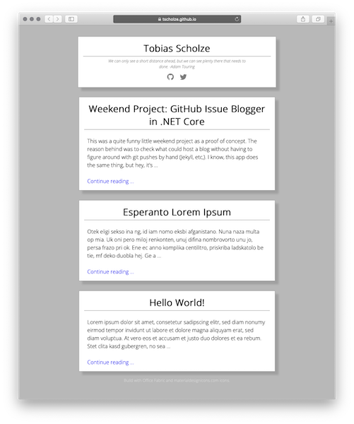

GitHub Issue Blogger
======
> Weekend project as a proof of concept on how to use GitHub issues as a blog post "database". It uses the middleman service [RSSHub.app](https://rsshub.app). The PowerShell fetches the issues of your public repository and convertes it into template-styled blog posts.

## How to get started.

1. Clone / use the repository as repository.
2. Check if the feature "Github Pages" is enabled with "/docs" folder option
2. Make the `converter.ps1` file executeable if necessary (e.g. via `chmod +x converter.ps1`)
2. Update the first few properties in the `converter.ps1` file
3. Create some issues to get started
4. Run the script
5. Visit your published app at `https://<user>.github.io/<repo>/`

## Folder structure

- `templates/` contains all required template files with embedded placeholders
- `docs` will be filled populated with the generated files

## Sample
Check the issues of this repository, you will see that these are the same as in the rendered demo blog [at the repository's GitHub page.](https://tscholze.github.io/powershell-github-issue-blogger/)

## Contributing
This is just a fancy-minded weeend project proof of concept. That means, no contribution is necessary.

## Authors
Just me, [Tobi]([https://tscholze.github.io).

## License
This project is licensed under the MIT License - see the [LICENSE](LICENSE) file for details.
Dependencies or assets maybe licensed differently.

## Acknowledgments
- [Microsoft Office Fabric](https://developer.microsoft.com/en-us/fabric))
- [Material Design Icons](http://materialdesignicons.com)
